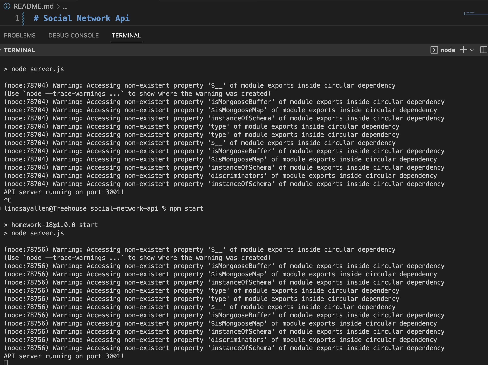
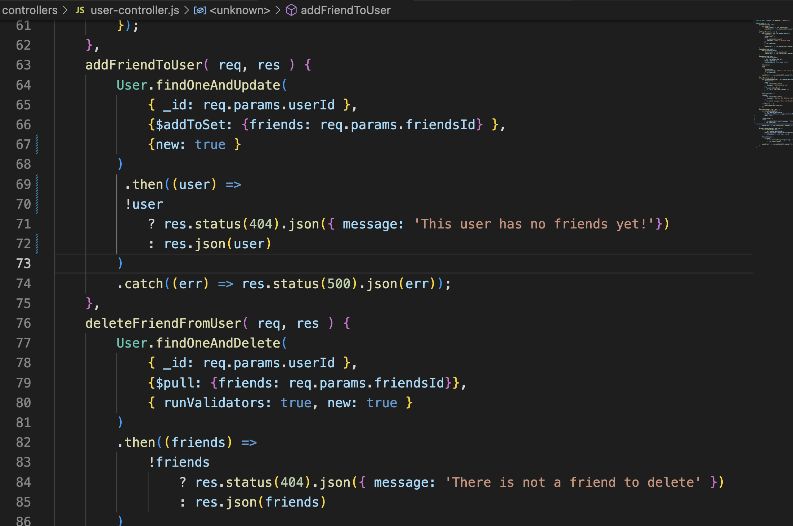

# Social Media API

*****
  

## Description
A simple social API using MongoDB with Mongoose package.
## Table of Contents
- [Description](#description)
- [Installation](#installation)
- [Usage](#usage)
- [License](#license)
- [Contributing](#contributing)
- [Tests](#tests)
- [Questions](#questions)
- [Sources](#sources)

*****

## Installation
npm express and mongoose. I also included a package email validator called validator. 

I had this error with all development and I was unable to sort it out. 
*****
## Usage
This project serves as a lesson on database routing and using api call methods to create a database.
 
*****
## License

[Open](https://wiki.creativecommons.org/wiki/Open_license#:~:text=An%20open%20license%20or%20free,use%20it%20how%20you%20want%22.)

This application is covered by the Open license. 
*****
## Contributing
Lindsay Allen
*****
## Link to walk through video
[walkthrough]()
*****
## Questions
Please create a pull request with any issues. 
*****

Find me on GitHub: [katsaymeow](https://github.com/katsaymeow)

Email me with any questions: allenlindsay812@gmail.com

    